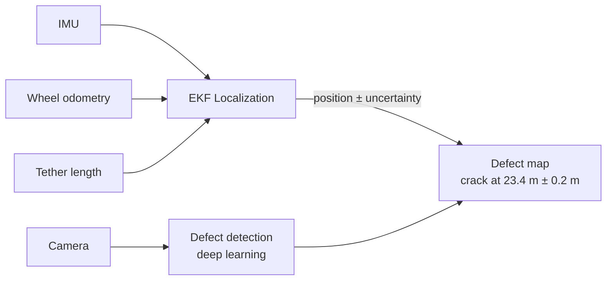

<!-- Animated header -->

<!-- Typing animation -->

  

## 🤖 About me
AI & ML student at the University of Zimbabwe, focused on **robotics**:
state estimation, sensor fusion, and perception for autonomous systems.

## 🔧 Currently building
An **in-pipe inspection robot** that knows where it is and what it's looking at:

## 🛠️ Tech

## 🤝 Team projects
- **[Esp32HydroponicProject](https://github.com/Mazly2004/Esp32HydroponicProject)**: ESP32 hydroponics monitoring (with @KeithAGang). I worked on …
- **[SwamoraPlantIdentification](https://github.com/Mazly2004/SwamoraPlantIdentification)**: plant identification (with @KeithAGang). I worked on …

## 🐍 Contributions
<picture>
  <source media="(prefers-color-scheme: dark)" srcset="https://raw.githubusercontent.com/Mazly2004/Mazly2004/output/github-snake-dark.svg" />
  
</picture>

## 📫 Contact
[Email](mailto:olivermazorodze1@gmail.com) · [LinkedIn](YOUR_LINKEDIN_URL)

